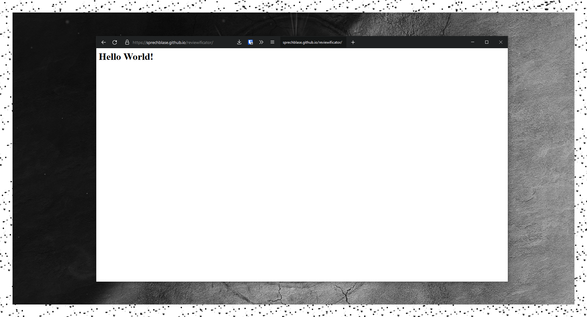

<h1 align="center">Reviewificator</h1>

<p align="center"></p>

A simple checklist template for video game reviews.
Licensed under MIT

This is a tool to simplify the creation of short steam game reviews.

## Usage

1) Tick all checkboxes you want

2) Press the "GENERATE STEAM RATING" button

3) Your review gets copied in your clipboard
    ```console
    +-\\ {GAME} Review by {STEAM USERNAME} //-+

    ♦ GAMEPLAY      →   0/5
    ♦ GRAPHICS      →   0/5
    ♦ AUDIO       →   0/5
    ♦ DIFFICULTY      →   0/5
    ♦ STORY      →   0/5
    ♦ PRICE      →   0/5

    ♦ Overall: 0/5

    Made with Reviewificator  ►  https://sprechblase.github.io/reviewificator/
    ```
    
___
<p align="center">Made with ❤️</p>