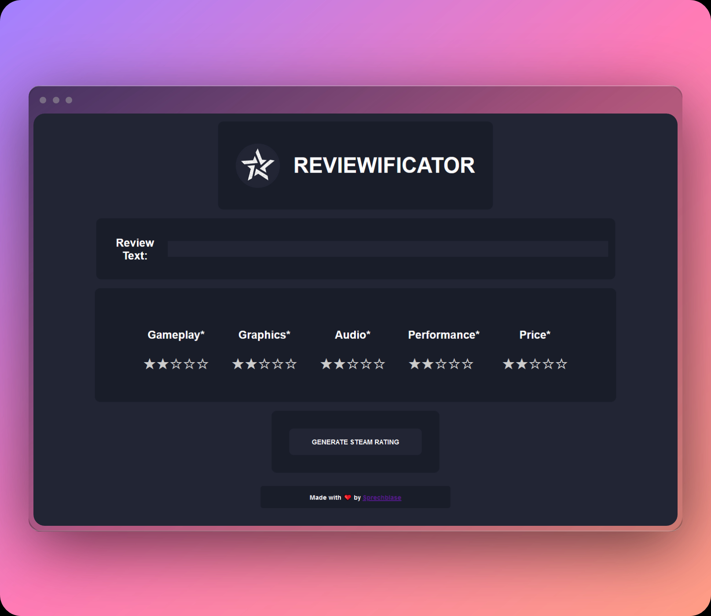

<h1 align="center">Reviewificator</h1>

<p align="center"></p>

A simple checklist template for video game reviews.  
> Licensed under MIT

This is a tool to simplify the creation of short steam game reviews.  
Hosted with ❤ by Github: https://sprechblase.github.io/reviewificator/

## Usage

1) Write your review (if you want) in the text box

2) Tick all checkboxes you want

3) Press the "GENERATE STEAM RATING" button

4) Your review gets copied in your clipboard
    ```console
    +-\\ Review //-+

	"Your Review Text" (*optional)

    ♦ GAMEPLAY      →   0/5
    ♦ GRAPHICS      →   0/5
    ♦ AUDIO       →   0/5
    ♦ PERFORMANCE      →   0/5
    ♦ PRICE      →   0/5

    ♦ Overall: 0/5

    Made with Reviewificator  ►  https://sprechblase.github.io/reviewificator/
    ```
    
___
<p align="center">Made with ❤️</p>